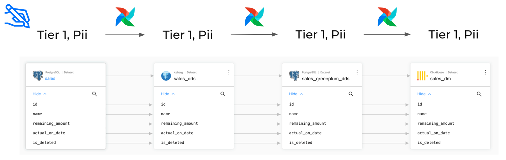

## Disclaimer
The code will be published later.

# Automated Tagging DAG based on the Data Lineage from DataHub

## Overview

This Airflow DAG is designed to automate the process of distributing tags among DataHub datasets and columns. It takes the tags from the source dataset, columns and copies them to the dependant ones based on the existing Data Lineage.

## Diagram

